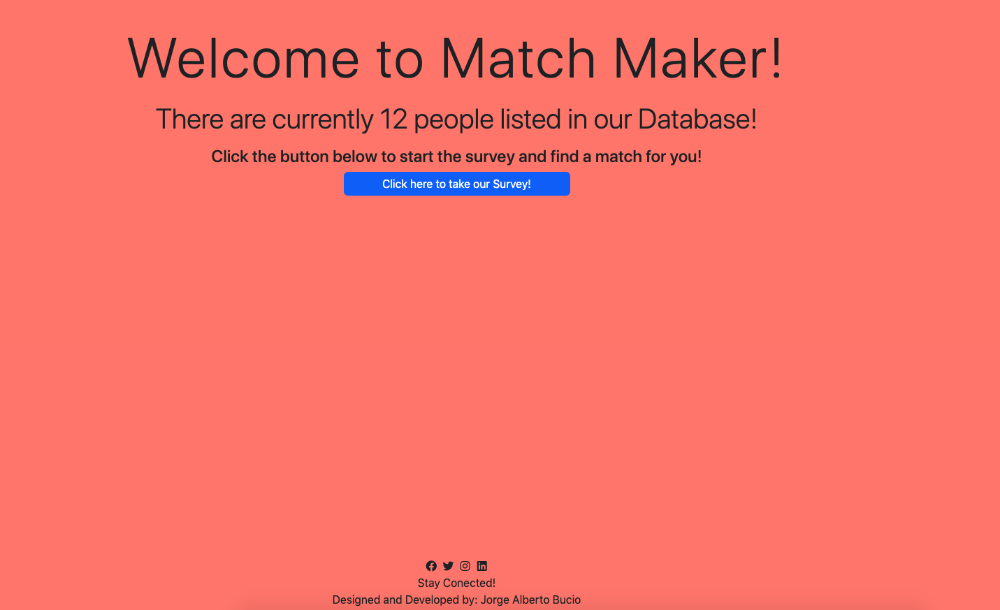
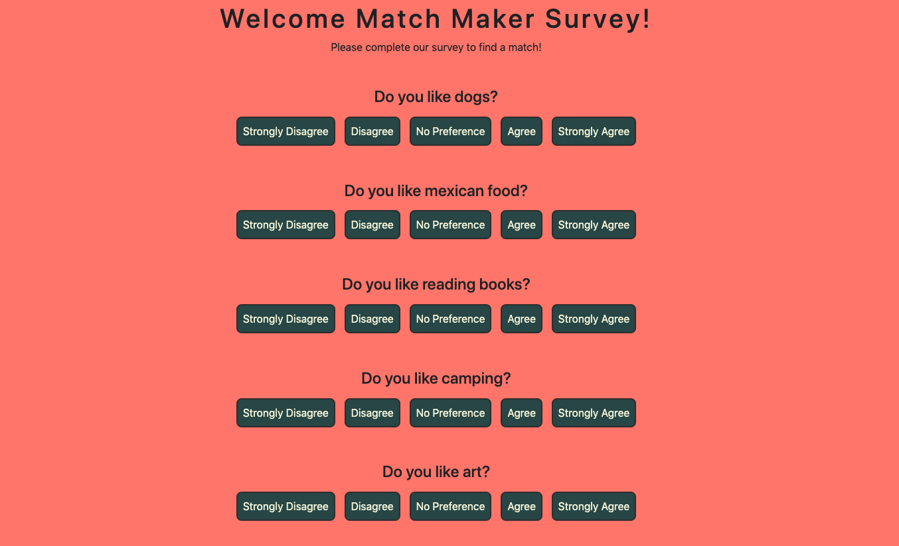
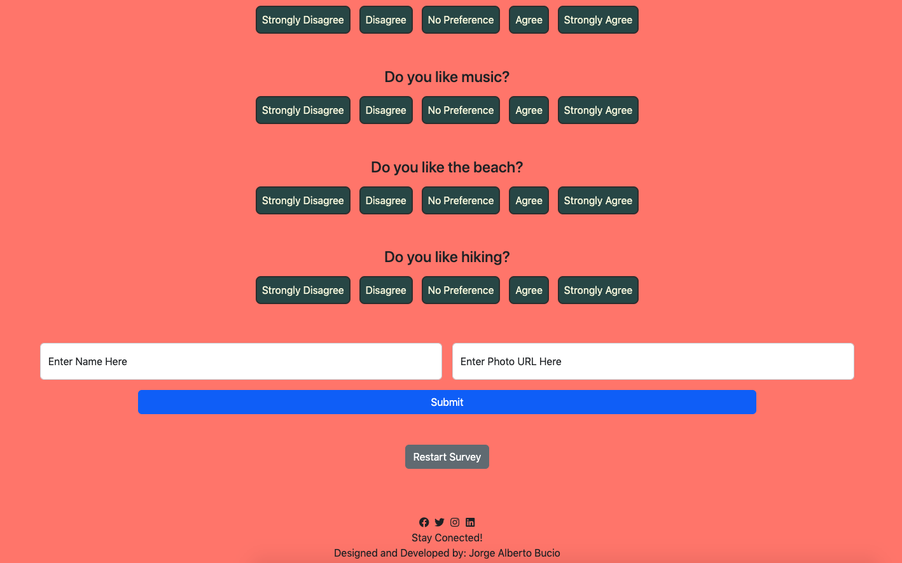
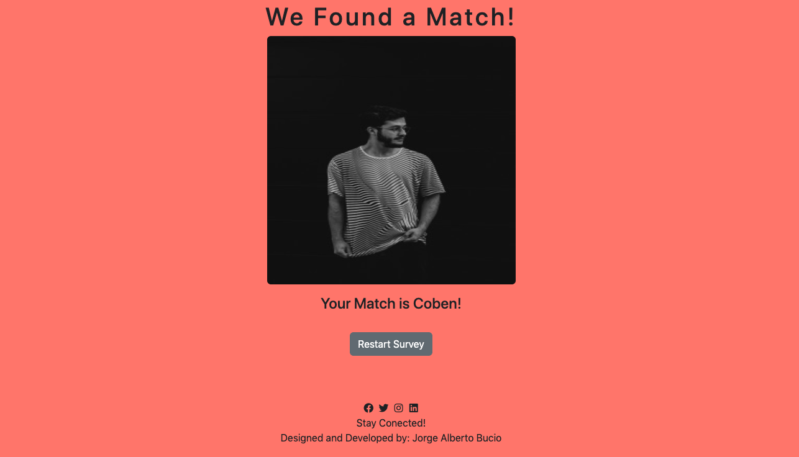
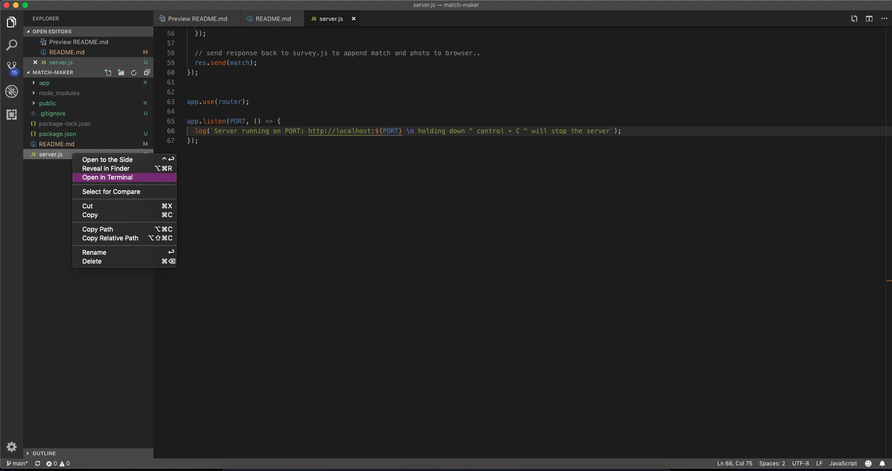
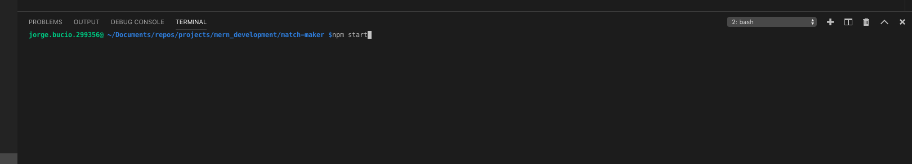
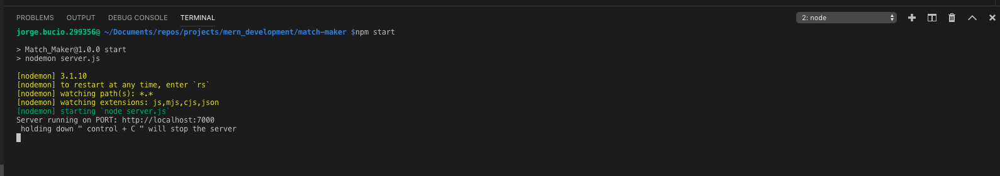

#  Match Maker Project 

##  Project background  

By this point I have covered the intermediate Javascript, things like `Object Oriendted Programming`, `Methods`, and `Destructuring concepts.` etc. I thought that routes would be a breeeze to figure out, but boy was I mistaken. Even thought this is not intended to be a difficult project, it sure felt 
like it. A massive thanks to everybody who helped me along the way to finish this project.

###  For this project I employed all of the things I have learned thus far.  

- HTML mark up is always at the top of the list for me.
- CSS to liven up the page a bit.
- Bootstrap to minimize CSS and to make styling page more streamlined.
- jQuery was used to simplify some code and AJAX.
- Express was used for the setting up the server.
- Node was used as well.

##  How to use the front end as a user:  

Introduction 
  - At first, the user will encounter the <q> Match Maker </q> with button displaying <q> click here to take our survey! </q> as a call to action. 
 

 First Stage   

- Clicking the `click here to take our survey!` button will take users to the survey page.

 

 Second Stage  

- Where the user will be asked `10 questions`.

 

 Third Stage  

- User will be sked to provide a `name` and `photo URL`. 

 

 Last Stage   

- Once the User clicks the `submit` button, the `survey` will vanish and a `picture` and an `image` the `match` made will be displayed for them.
- The User will have the `option` to begin the process all over again.

 

##  Project styles  

For this project I kept it simple since I had time constraints.

###  Colors used for this project.  

- Black: #000
- Beige: #f4f4db
- Darkslategrey: #2f4f4f
- White: #fff
- Coral: #ff7f50
- Boostrap's info and secondary for buttons
- Charcoal: #333

###  Fonts used for this project.    

- Arial, Helvetica, sans-serif.

##  How to use the backend:  

 First Stage   

- Open <q> `server.js` </q> file in terminal.

 

 Second Stage  

- Type <q> `npm start` </q> in the terminal.
- Then open <q> `http://localhost:7000` </q> in your browser.

 

 Third Stage  

- Holding down <q> `control + c` </q> keys will stop the server. 

 